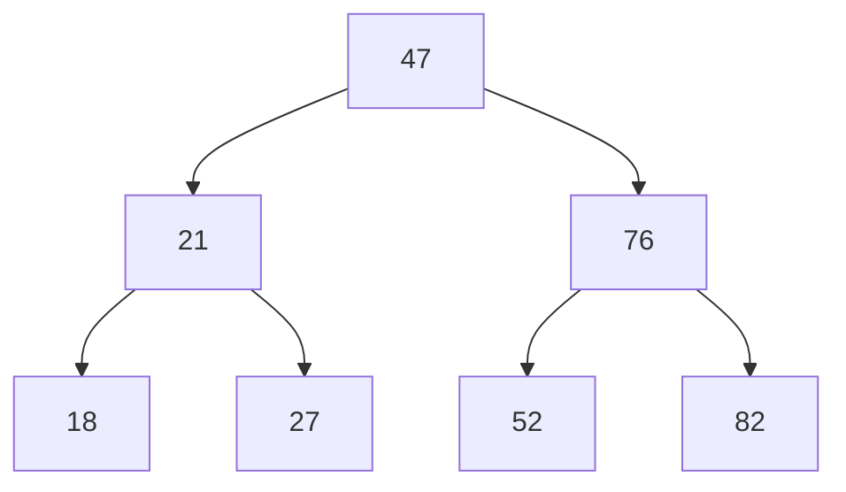

Return to [[Binary Tree Traversal]]

```table-of-contents
title: 
style: nestedList # TOC style (nestedList|nestedOrderedList|inlineFirstLevel)
minLevel: 2 # Include headings from the specified level
maxLevel: 2 # Include headings up to the specified level
include: 
exclude: 
includeLinks: true # Make headings clickable
hideWhenEmpty: false # Hide TOC if no headings are found
debugInConsole: false # Print debug info in Obsidian console
```
# Breadth First Search #algorithm 
## Binary Search Tree

A **Binary Search Tree** (BST) is a tree data structure where each node has at most two children, and for any node:

 - The **left child** contains a value *less than* the node’s value.
 - The **right child** contains a value *greater than* the node’s value.



A #tree like this has a few properties that distinguish the nodes.

The **Root** is 47.

The **Root** should fall **nearly half way** between the *smallest* number, and the *largest* number.

Each of the **Child Nodes** ( #nodes)should be arranged with the *smaller number* on the **Left**, and the *larger number* on the **Right**.

## Breadth First Search Structure

In order to perform the **Breadth First Search** ( #search ), we need 2 arrays:
1. queue = [ node, node, node]
	- Nodes go into the #Queue, because it *retains the connections* to it’s Children.
2. results = [ value, value, value]
	- Values go into the Results, because that’s what we are going to *return* from our function.

### Deeper Dive into Queue
- [[Queue Explained]]

### Tree & Code


```js
// Breadth First Search
BFS() {
	let currentNode = this.root
	let queue = []
	let results = []
	queue.push(currentNode)

	while(queue.length) {
		// remove the element from the front of the queue
		currentNode = queue.shift() 
		// push the Value of the Node to results array
		results.push(currentNode.value)
		// add the Children to the queue
		if(currentNode.left) queue.push(currentNode.left)
		if(currentNode.right) queue.push(currentNode.right)
	}
	return results
}
```
Pushing 47 into the `queue` enqueues it’s children, nodes 21 and 76.

We **remove the Node** from the *front of the queue*, and save it as `currentNode`.

Then we push the Value of the Node into the `results` array

We continue to add the Children to the Queue.

And then push the Value of them to the results array, as we traverse the tree to the bottom.

#### Creating our Classes

We can construct our Binary Search Tree as a #class.

Then declare our Breadth First Search as a method within the BST Class.

```js
class Node {
	constructor(value) {
		this.value = value
		this.left = null
		this.right = null
	}
}

// Binary Search Tree
class BST {
	constructor() {
		this.root = null
	}
	
	insert(value) {
		const newNode = new Node(value)
		if (this.root === null) {
			this.root = newNode
			return this
		}
		let temp = this.root
		while(true) {
			if (newNode.value === temp.value) return undefined
			if (newNode.value < temp.value) {
				if(temp.left === null) {
					temp.left = newNode
					return this
				}
				temp = temp.left
			} else {
				if(temp.right === null) {
					temp.right = newNode
					return this
				}
				temp = temp.right
			}
		}
	}
	
	contains(value) {
		if (this.root === null) return false
		let temp = this.root
		while(temp) {
			if (value < temp.value) {
				temp = temp.left
			} else if (value > temp.value) {
				temp = temp.right
			} else {
				return true
			}
		}
		return false
	}
		
	// Breadth First Search
	BFS() {
		// transport Nodes out of the queue
		let currentNode = this.root
		// hold the Child Nodes for processing
		let queue = []
		// hold the Values of the Nodes
		let results = []
		queue.push(currentNode)
	
		while(queue.length) {
			// remove the element from the front of the queue
			currentNode = queue.shift() 
			// push the Value of the Node to results array
			results.push(currentNode.value)
			// add the Children to the queue
			if(currentNode.left) queue.push(currentNode.left)
			if(currentNode.right) queue.push(currentNode.right)
		}
		return results
	}
}

// Create your Tree
let myTree = new BST()
myTree.insert(47)
myTree.insert(21)
myTree.insert(76)
myTree.insert(18)
myTree.insert(27)
myTree.insert(52)
myTree.insert(82)

// The results of our Breadth First Search
myTree.BFS()
// [47, 21, 76, 18, 52, 82]
```

## CodePen Example

For a working example of the Algorithms, checkout [React Binary Search Tree](https://codepen.io/JasonToups/pen/VYvypvv)
## My Docs

Continue to [[Depth First Search]].
Return to [[Binary Tree Traversal]]

Search for pages that mention #algorithms 
Or look for an individual #algorithm 