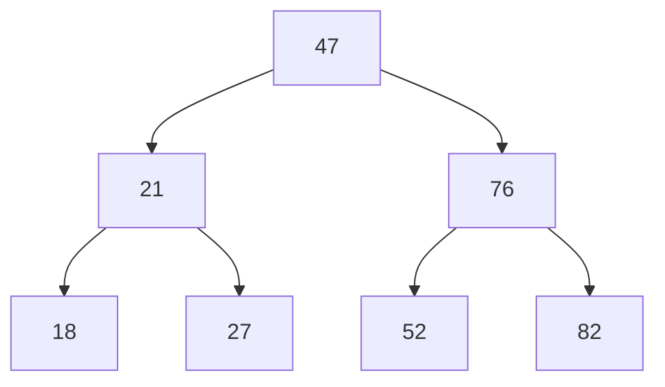

Return to [[Binary Tree Traversal]]
```table-of-contents
title: 
style: nestedList # TOC style (nestedList|nestedOrderedList|inlineFirstLevel)
minLevel: 2 # Include headings from the specified level
maxLevel: 2 # Include headings up to the specified level
include: 
exclude: 
includeLinks: true # Make headings clickable
hideWhenEmpty: false # Hide TOC if no headings are found
debugInConsole: false # Print debug info in Obsidian console
```
# Depth First Search #Algorithms 

If **Breadth First Search** starts at the *Root Node*, and works its way *down*,
**Depth First Search** starts at the *bottom* of the Tree and works its way *up*.

There are *3 Depth First Search algorithms* that traverse the #Tree in different ways.

1. **Pre Order** - Node, Left, Right
2. **Post Order** - Left, Right, Node
3. **In Order** - Left, Node, Right

| Algorithm      | First Node | Second Node | Third Node | Explanation                                                                                                                                                             |
| -------------- | ---------- | ----------- | ---------- | ----------------------------------------------------------------------------------------------------------------------------------------------------------------------- |
| **Pre Order**  | Node       | Left        | Right      | Visit the *current node* first, then recursively traverse the *left* subtree, then the *right* subtree.                                                                 |
| **Post Order** | Left       | Right       | Node       | Recursively traverse the *left* subtree, then the *right* subtree, and visit the *current node* last.                                                                   |
| **In Order**   | Left       | Node        | Right      | recursively traverse the *left* subtree, visit the *current node*, then traverse the *right* subtree. On a Binary Search Tree, this yields values in *ascending order*. |

## Depth First Search - Preorder #algorithm 

Depth First Search (DFS) explores as far down one branch of a tree as possible before backtracking. 


DFS **PreOrder** follows a specific traversal order:

1.	Visit the **current** node
2.	Traverse the **left** subtree
3.	Traverse the **right** subtree

This is often expressed as **NLR** (Node → Left → Right).
```javascript
  // Depth First Search - PreOrder
  DFSPreOrder() {
    let rootNode = this.root;
    let results = [];
    if (!rootNode) return results;

    const traverse = (currentNode) => {
      results.push(currentNode.value);
      if (currentNode.left) traverse(currentNode.left);
      if (currentNode.right) traverse(currentNode.right);
    };

    traverse(rootNode);
    return results;
  }
```
Which returns `[47, 21, 18, 27, 76, 52, 82]`


### Real World Uses

**DFS PreOrder** is especially useful when:
#### Copying or Cloning Trees
Since you visit the node before children, you can *recreate the structure* in the exact order.
#### Serializing Data Structures
Storing a tree into a flat file or database often uses PreOrder so you can *rebuild the tree* later.
#### Expression Parsing in Compilers
PreOrder traversal is used to *parse expressions* and generate *prefix notation* (e.g., + 3 * 2 5).
#### Rendering Nested UI in React
If you think of a component tree as a binary/n-ary tree, PreOrder traversal is similar to how **React** recursively renders *parent* components before their *children.

> In React, this can be applied conceptually when walking a *virtual DOM tree* or any **hierarchical data structure** (menus, file trees, org charts) where you want to process the *parent first*, *then* the *children*.

## Depth First Search - Post Order #algorithm 

Like PreOrder, this is a type of DFS traversal.

DFS **PostOrder** follows this traversal order:

1.	Traverse the **left** subtree
2.	Traverse the **right** subtree
3.	Visit the **current** node

This is often expressed as **LRN** (Left → Right → Node).

```javascript
// Depth First Search - PostOrder
DFSPostOrder() {
  let rootNode = this.root;
  let results = [];
  if (!rootNode) return results;

  const traverse = (currentNode) => {
    if (currentNode.left) traverse(currentNode.left);
    if (currentNode.right) traverse(currentNode.right);
    results.push(currentNode.value);
  };

  traverse(rootNode);
  return results;
}
```
Which returns `[18, 27, 21, 52, 82, 76, 47]`


### Real World Uses

DFS PostOrder is especially useful when:
#### Deleting or Freeing Nodes in a Tree
For example, in **memory management**, you want to *delete children* **before** *deleting the parent*. PostOrder ensures the root is deleted last.
#### Evaluating Expressions in a Parse Tree
PostOrder corresponds to [postfix notation](https://en.wikipedia.org/wiki/Reverse_Polish_notation) (Reverse Polish Notation).
Example: For (3 + (2 × 5)), the PostOrder output is 3 2 5 × +, which is how many calculators evaluate math.
#### Dependency Resolution
In tasks where dependencies must be resolved before a parent task, PostOrder ensures children are handled first.
#### Rendering Cleanup
In UI frameworks, if you need to tear down or clean up child components/resources before their parent, PostOrder traversal mirrors this order.

#### Unmounting Component Tree in React
In React terms, think of unmounting a component tree:

Children get unmounted before their parent — that’s essentially PostOrder traversal in action.

## Depth First Search - In Order #algorithm

Like PreOrder, this is a type of DFS traversal.

DFS **InOrder** traversal follows the order:
1.	Traverse the left subtree
2.	Visit the current node
3.	Traverse the right subtree

This is often expressed as **LNR** (Left → Node → Right).
```javascript
// Depth First Search - InOrder
DFSInOrder() {
  let rootNode = this.root;
  let results = [];
  if (!rootNode) return results;

  const traverse = (currentNode) => {
    if (currentNode.left) traverse(currentNode.left);
    results.push(currentNode.value);
    if (currentNode.right) traverse(currentNode.right);
  };

  traverse(rootNode);
  return results;
}
```
Which returns `[18, 21, 27, 47, 52, 76, 82]`

### Real World Uses

DFS InOrder is useful when:
#### Sorting Data
InOrder traversal of a BST always gives elements in ascending order. This makes it a natural way to extract a sorted list from a tree.
#### Checking Validity of a BST
If the InOrder traversal does not result in a strictly increasing sequence, the tree is not a valid BST.
#### Database Indexing
B-Trees (a generalization of BSTs) use InOrder traversal to keep data sorted for fast lookups and range queries.
#### Iterating Through UI Hierarchies in Order
For example, imagine a document editor tree where InOrder traversal lets you process text nodes in the correct reading sequence (left-to-right).
#### Rendering Directory Contents in React
In React terms: If you think of a file explorer, InOrder traversal could be used to render directory contents in sorted order (folders first, then files), since it naturally respects ordering.

## CodePen Example

For a working example of the Algorithms, checkout [React Binary Search Tree](https://codepen.io/JasonToups/pen/VYvypvv)

## My Docs

[[Binary Tree Traversal]]
[[Breadth First Search]]

Search for pages that mention #algorithms 
Or look for an individual #algorithm 